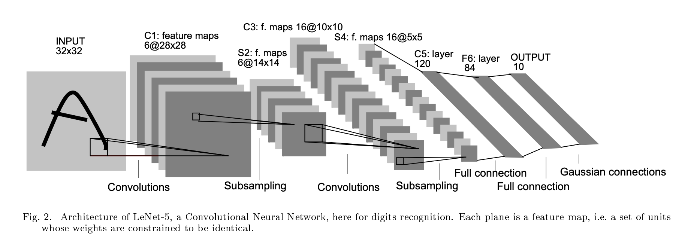

# LeNet-5

This repository implements the LeNet-5 model for handwritten digit recognition. LeNet was likely the first deep neural network used for a "real-world" or commercial application ([Source](https://karpathy.github.io/2022/03/14/lecun1989/)).
