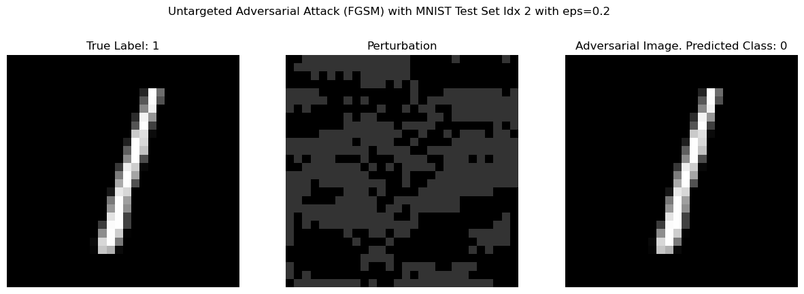

# LeNet-5

[<a href="http://vision.stanford.edu/cs598_spring07/papers/Lecun98.pdf">Image Source</a>]

This repository implements the LeNet-5 model for handwritten digit recognition. The implementation is based on the model described in *"Gradient-Based Learning Applied to Document Recognition"* (1998) by LeCun, Bottou, Bengio, and Haffner. 

Some architectural changes have been made to allow LeNet-5 to accept 28x28 pixel inputs from the modern MNIST dataset. The 1998 paper's model was trained on 32x32 pixel images. 

### Usage
Models can be trained and evaluated with [`lenet.ipynb`](lenet.ipynb). 

You can also train directly from the command line by running `$ python src/train.py`.

### Ablations
Deep learning best practices have changed since LeNet-5 was published in 1998. By individually tweaking aspects of the data, architecture, and training, we can identify which changes have been most beneficial to performance on small convolutional models like LeNet-5.

TODO: Add ablation chart

### Interpretability
The inner workings of a deep neural network's classification decisions are not immediately visible in a human-understandable way. Various interpretability techniques in [`lenet.ipynb`](lenet.ipynb) try to mechanistically explain how the trained LeNet-5 model works.

#### Gradient-Based Methods
Saliency maps and Grad-CAM use the gradient to highlight the most important pixels/regions in an image influencing the model's prediction.

#### Linear Probes

#### Sparse Autoencoder (SAE)

### Adversarial Examples
The model implicitly learns representations of the MNIST images when trained on a classification objective. We can test the robustness of these representations by constructing *adversarial examples*. These examples are found by subtly perturbing actual digit images in a way that maximizes the error of our LeNet-5 classifier. Two *white-box* adversarial attacks, described below, are provided in this repository, with both untargeted (minimizes correct logit) and targeted (maximizes target class logit) implementations. 

#### Fast Gradient Sign Method (FGSM)
FGSM is a one-step attack that takes the gradient $\nabla_x L(x,y)$ of the input image with respect to the loss and adds a small perturbation $\epsilon$ in the direction of the gradient.

#### Project Gradient Descent (PGD)
PGD is an iterative attack, effectively an iterated version of FGSM.
